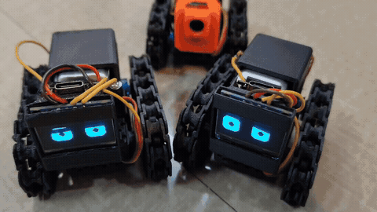

# LUN-E

**We've deployed a swarm of autonomous rovers to the Moon. They need YOUR help.**

> One of them won't cross a crater because it "doesn't feel right."

LUN-E is a campaign site for [T-01: The Explorer](https://github.com/harshith-cmd/T-01-The-Explorer) — an open-source rover platform with an ESP32-C3 brain, OLED eyes, tank treads, and *opinions*.

This repo is the landing page at **[lune.absurd.industries](https://lune.absurd.industries/)**.

## What's in here

- `index.html` — single-page Vue 3 app (CDN-loaded, no build step)
- `style.css` — custom styles and animations
- `app.js` — Vue instance, counters, scroll animations
- `images/` — rover media assets
- `videos/` — looping rover footage

## Run locally

Open `index.html` in a browser. That's it. No npm. No webpack. No existential crisis.

## The rovers

Real. ESP32-C3 powered. Emotionally unpredictable. Currently deployed on a bedsheet in Bengaluru.

The FTL communication protocol is not real. The rover that refused to cross a crater — that one's real.

**[Build your own](https://github.com/harshith-cmd/T-01-The-Explorer)** or **[join the Discord](https://discord.com/invite/DUSUtguG2H)** to know when they're available to purchase.

## License

[GPL-3.0](LICENSE)

---

Made with too little sleep in Bengaluru, India by [Absurd Industries](https://absurd.industries).
